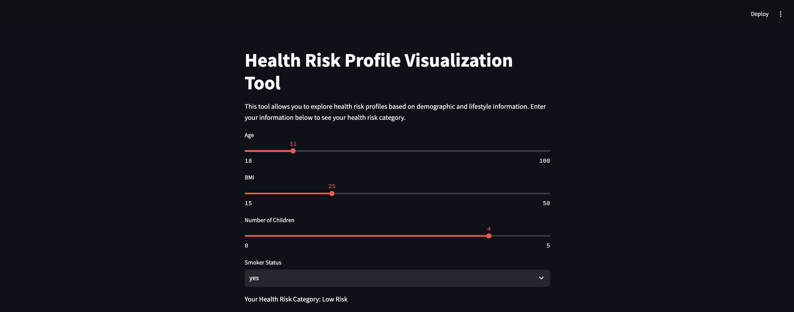

# Health Risk Profile Visualization Tool

This repository includes the code for a basic **Health Risk Profile Visualization Tool**. This tool, created in Python with the help of **Streamlit** and **Plotly**, enables users to enter demographic and lifestyle data to get a broad health risk evaluation. It aims to assist users in understanding their positioning within specific health risk classifications, considering factors like **BMI**, **age**, **smoking habits**, and **number of children**. Furthermore, it provides a visual comparison of the user's inputs against a larger dataset.

---

## Context

In the field of healthcare, recognizing significant health risk determinants such as BMI, age, and smoking status can aid in pinpointing individuals who may benefit from specific healthcare interventions. This tool offers users a fundamental health risk evaluation, assisting them in understanding their positioning within broader risk categories based on these attributes.

Inspired by initial health screening methods, this tool illustrates how data-driven solutions can enhance health awareness. While it remains an elementary tool, it showcases the potential for utilizing data science to provide personalized health insights.

---

## Features

- **User Engagement**: Gathers demographic and lifestyle information such as age, BMI, smoking habits, and number of children.
- **Health Risk Evaluation**: Determines a health risk level (Low, Moderate, High) based on user responses, utilizing widely recognized health metrics.
- **Graphical Comparisons**: Delivers histograms that illustrate how the user's BMI and age relate to the distribution found in a broader dataset.

---

## Screenshots

### Main Interface

### BMI and Age Distribution Comparison

---

## To Utilize the Tool

1. **Input Personal Details**:  
   Make use of the interactive sliders and dropdown menus to provide information such as age, BMI, smoking status, and number of dependents.

2. **Examine Health Risk Classification**:  
   The tool will indicate a risk level (Low, Moderate, High) depending on your inputs.

3. **Contrast with Dataset**:  
   Observe how your BMI and age measure up against the general population in the dataset through the histograms.

4. **Review Health Recommendations**:  
   Based on your determined risk level, go through the health recommendations presented at the bottom.

---

## Future Enhancements

This tool offers a fundamental health risk evaluation and has the potential for various improvements:

- **Machine Learning Integration**: Incorporate a machine learning model to generate a more precise, data-based risk evaluation.
- **Expanded Health Metrics**: Include additional metrics such as blood pressure or physical activity to expand the range of the risk evaluation.
- **Tailored Health Recommendations**: Provide more specific guidance based on the individual’s comprehensive profile for a customized experience.

---
